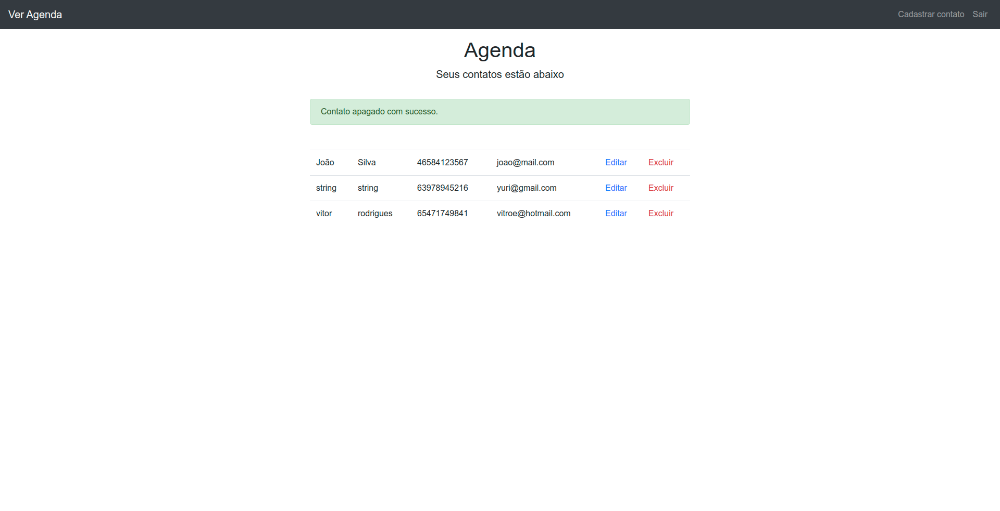

<h1 align="center">Projeto Agenda</h1>

 

<h2 align="center">Print</h2>

  

## 🚀 Tecnologias

Esse projeto foi desenvolvido com as seguintes tecnologias:

- [Node.js](https://nodejs.org/en/)
- [HTML]
- [CSS3]
- [JavaScript]
- [MongoDB]

## 💻 Projeto

O Projeto Agenda possui um frontend com html, css, javascript puro e no backend foi utilizado javascript também com o nodeJs, 
esse projeto possui autenticação de usuário onde após a autenticação ele pode adicionar, editar ou excluir contatos.

Feito Durante o curso de Javascript e Typescript do professor Luiz Otávio.
